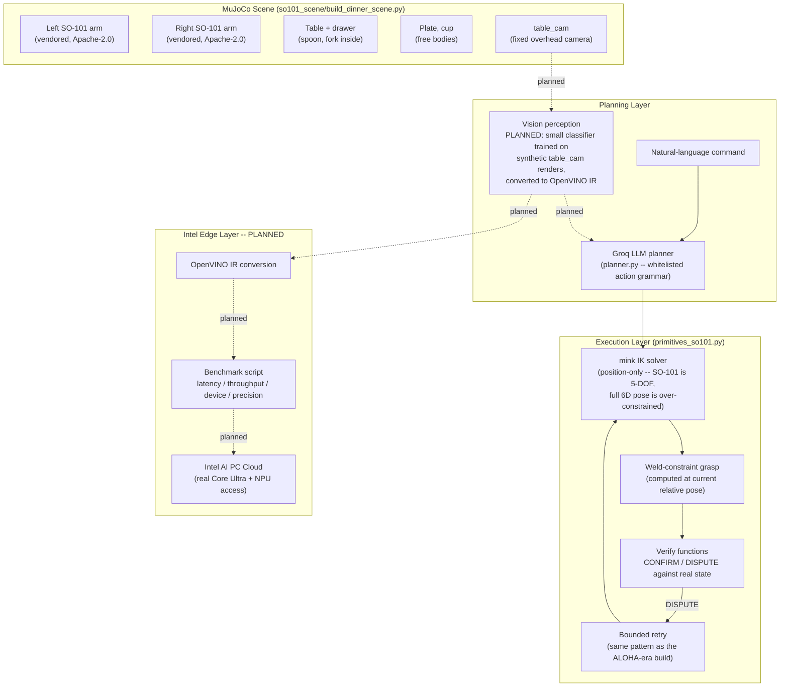
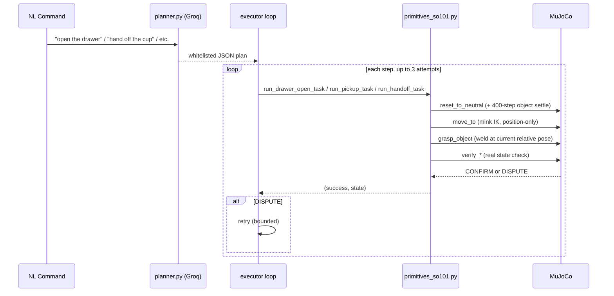

# Bimanual VLA Manipulation — Architecture

*Part of [the main README](./README.md) — read
[`so101_scene/STATUS.md`](./so101_scene/STATUS.md) for what's actually
verified vs. planned before treating anything here as finished.*

## Overview

Two simulated SO-101 arms (vendored from `TheRobotStudio/SO-ARM100`,
Apache-2.0) share one MuJoCo scene: a table, a drawer holding a spoon and
fork, a plate, and a cup. A natural-language command goes to an LLM planner
(Groq), which returns a small, whitelisted JSON action plan. Each action is
executed by classical IK primitives (via `mink`), then checked against real
MuJoCo state — CONFIRM if it matches, DISPUTE and bounded-retry if not. A
fixed overhead camera (`table_cam`) exists in-scene for the camera-based
reasoning and OpenVINO perception work (in progress — see status table in
the README).

## System diagram (current + planned)

## Data flow — task execution (verified pattern)

## Real bugs found and fixed this session (disclosed, not hidden)

1. **Cutlery-blocks-drawer**: spoon/fork spawn position overlapped the
   drawer's own collision box, mechanically preventing it from opening past
   ~half its travel. Fixed by repositioning cutlery clear of the drawer's
   swept footprint.
2. **Static-gripper-blocks-drawer**: the gripper stayed closed and
   physically stationary at the handle while the actuator tried to slide the
   drawer open underneath/through it — the drawer's own collision box rammed
   into the static gripper mesh. Fixed with a two-stage retreat (straight
   up, then to the side) before actuating the drawer.
3. **Arm-base-spacing-exceeds-reach**: original spacing (0.76m total) put
   the handoff zone ~0.44m from each base — beyond SO-101's demonstrated
   ~0.27-0.30m reach (a much shorter arm than the ALOHA rig used in the
   earlier build). Fixed by tightening spacing to 0.48m total and
   repositioning all objects.
4. **Tall-object-grasp-collision**: moving the gripper frame exactly to a
   tall object's center (the cup) drove the gripper mesh into the object's
   bulk, causing a violent contact-force launch on settle. A thin object
   (the plate) didn't show this. Fixed with a small upward grasp offset for
   the final approach point.

See [`so101_scene/STATUS.md`](./so101_scene/STATUS.md) for the currently
unresolved interaction between these fixes (a settle-timing change that
fixed spoon/fork regressed drawer/cup).

## Component reference

| File | Responsibility |
|---|---|
| `so101_scene/build_dinner_scene.py` | Builds the dual-SO-101 dinner-table scene from scratch using MuJoCo's `MjSpec` API — attaches two independent SO-101 instances with `left_`/`right_` name prefixes, adds table/drawer/cutlery/plate/cup, adds the `table_cam` fixed overhead camera, adds weld-constraint equalities for grasping |
| `so101_scene/primitives_so101.py` | Task primitives: `reset_to_neutral` (includes object-settle step), `move_to` (position-only mink IK), `grasp_object`/`release` (weld-based), `approach_and_grasp` (retry loop with grasp-offset), `run_drawer_open_task`, `run_pickup_task`, `run_handoff_task`, verify functions |
| `so101_scene/so101_new_calib.xml` + `assets/` | Vendored SO-101 robot model (`TheRobotStudio/SO-ARM100`, Apache-2.0) |
| `planner.py` | Groq LLM planner — NL command to whitelisted JSON action list (currently wired to the earlier ALOHA-era action set; porting to the SO-101 task set is a next step) |
| `executor.py` | Verify/replan loop — bounded retries, CONFIRM/DISPUTE tagging (pattern carries over unchanged, will be repointed at `primitives_so101.py`'s task functions) |
| `dashboard/` | FastAPI + WebSocket live dashboard |
| `Dockerfile`, `render.yaml` | Headless-MuJoCo deployment (OpenVINO runtime to be added once the perception component exists) |

## Why position-only IK for SO-101

SO-101 has 5 arm joints (`shoulder_pan`, `shoulder_lift`, `elbow_flex`,
`wrist_flex`, `wrist_roll`) plus a gripper joint. A full 6D pose target
(3D position + 3D orientation) is mathematically over-constrained for 5
degrees of freedom — the arm cannot independently satisfy both in general.
Confirmed empirically in-session: adding any nonzero `orientation_cost` to
the `mink.FrameTask` measurably hurt IK convergence compared to
`orientation_cost=0.0` (position-only), so the primitives solve for position
and let orientation fall out of the posture-regularized solution rather than
fighting the arm's real kinematic limits.

## Planned: vision + OpenVINO (highest-priority remaining work)

Not yet built. The design intent, to be updated once implemented:

1. Render `table_cam` at each task step via MuJoCo's offscreen renderer
   (already proven working in this repo's Docker/OSMesa setup from the
   earlier ALOHA-era build).
2. Generate labeled synthetic training data from the sim's own ground truth
   (e.g. drawer open/closed, which object is where) — no manual labeling
   needed since the simulator knows the true state.
3. Train a small classifier (not a large VLA policy — disclosed as a
   deliberate scope decision, not a hidden limitation).
4. Convert to OpenVINO IR via `ovc`, benchmark on CPU locally and, if Intel
   AI PC Cloud access comes through, on real Core Ultra CPU/iGPU/NPU.
5. Feed the classifier's output into the planner alongside the NL command,
   so the plan can adapt to actual detected scene state — this is what
   satisfies "reasons over camera observations" honestly, at a scope that's
   actually achievable in the time available.
